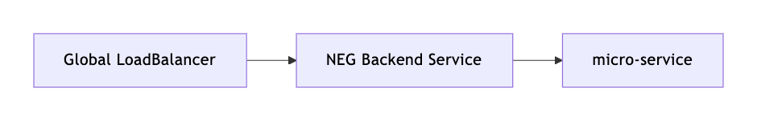

## TL;DR
- 內部線路追查
- 問題根因確認

## 背景
公司內部 RD 他們後端為了降低負載，在前端有掛了 CDN
但近一週，卻還是有 client 直接到 server 端取資料的 log
而他們會有 log 有兩個情況
1. CDN 掛掉
2. client 端 timeout(2s), 改直接到 server 端取資料

### 問題追查
先透過 `nslookup` 確認服務打得 domain 指向 ip 為 34.x.x.x，是我們 GCP ip 範圍
後續確認 ip 所屬服務為 `Global LoadBalancer`，並在其 `backend` 注意到是用 [NEG](https://cloud.google.com/load-balancing/docs/negs) 的網路架構

往後查看才發現，原來這個所謂的 `cdn domain` 背後實際上還是打到 `Kubernetes` 內部，透過 `nginx proxy` 到指定資源儲存倉

### 確認 `nginx proxy` 狀態
從 log 觀察 RD 反應有問題的幾個時間點
`5/14 14:10`, `5/17 6:31`, `5/19 8:38`

- 並不是所有時間點的 log 都是相對大量

從 metrics 觀察 `cpu`

- 服務並無中斷
- 不是所有時間點，都是 metrics 的 spike

回頭確認服務所屬的 node 資源

- 資源是比較吃緊的

且回頭確認服務的資源配置如下
有設置 cpu request 卻沒有設置 limit

👉 故推測，可能是 node 資源吃緊
造成服務端的資源競爭，導致 response 產生 latency
最後才會有 client 端改直接到 server 端取資料的結果

## 解決方案
對服務做資源調整
後續再觀察
