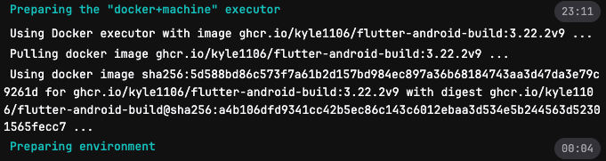
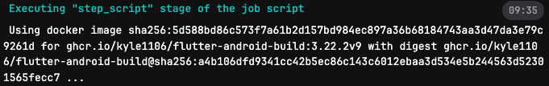
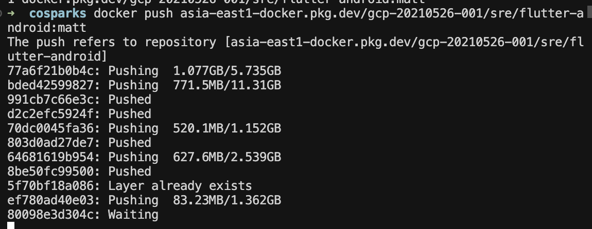

## TL;DR
CI/CD 優化，pipeline 流程加速

## 背景
公司內部的 CI/CD runner 都是自建的
某個服務的 CI/CD 在 build 流程會需要超過 30 分鐘來完成
經過分析發現 `image pull` & `build-script` 兩個流程是比較費時的


<br/>而這兩個部分也有很直覺的優化方向

### Pull Image
該 ghrc 是 github 上的 container registry, 會有自己的 ratelimit 限制，導致任務異常的費時

:point_right: 手動把 `image` 拉下來後，推到與 runner 同個 GCP Project 的 GAR

在 push image 的過程中發現有些 layer 重複了


透過 docker history 嘗試確認發現
該 image 並不是透過 Dockerfile 管理 & 建立
```
docker history <image_name>:<image_tag>            
IMAGE          CREATED         CREATED BY                                      SIZE      COMMENT
5d588bd86c57   5 weeks ago     bash                                            5.74GB    
<missing>      6 weeks ago     /bin/bash                                       11.3GB    
<missing>      6 weeks ago     /bin/bash                                       1.35kB    
<missing>      7 weeks ago     bash                                            202B      
<missing>      7 weeks ago     bash                                            1.15GB    
<missing>      7 weeks ago     bash                                            135MB     
<missing>      12 months ago   RUN |2 flutter_ver=3.22.2 build_rev=0 /bin/s…   2.54GB    buildkit.dockerfile.v0
<missing>      12 months ago   ENV FLUTTER_HOME=/usr/local/flutter FLUTTER_…   0B        buildkit.dockerfile.v0
<missing>      12 months ago   ARG build_rev=0                                 0B        buildkit.dockerfile.v0
<missing>      12 months ago   ARG flutter_ver=3.22.2                          0B        buildkit.dockerfile.v0
<missing>      13 months ago   RUN /bin/sh -c yes | sdkmanager     "platfor…   259MB     buildkit.dockerfile.v0
<missing>      13 months ago   ENV ANDROID_BUILD_TOOLS_VERSION=34.0.0          0B        buildkit.dockerfile.v0
<missing>      13 months ago   ENV ANDROID_PLATFORM_VERSION=34                 0B        buildkit.dockerfile.v0
<missing>      13 months ago   RUN /bin/sh -c if [ $(uname -m) == "x86_64" …   0B        buildkit.dockerfile.v0
<missing>      13 months ago   RUN /bin/sh -c set -o xtrace     && cd /opt …   1.36GB    buildkit.dockerfile.v0
<missing>      13 months ago   ENV ANDROID_SDK_TOOLS_VERSION=10406996          0B        buildkit.dockerfile.v0
<missing>      13 months ago   ENV ANDROID_SDK_ROOT=/opt/android-sdk-linux …   0B        buildkit.dockerfile.v0
<missing>      13 months ago   ENV ANDROID_HOME=/opt/android-sdk-linux LANG…   0B        buildkit.dockerfile.v0
<missing>      13 months ago   USER root                                       0B        buildkit.dockerfile.v0
<missing>      13 months ago   LABEL org.opencontainers.image.source=https:…   0B        buildkit.dockerfile.v0
<missing>      13 months ago   /bin/sh -c #(nop)  CMD ["/bin/bash"]            0B        
<missing>      13 months ago   /bin/sh -c #(nop) ADD file:ac9d5a9d5b9b1217a…   76.2MB    
<missing>      13 months ago   /bin/sh -c #(nop)  LABEL org.opencontainers.…   0B        
<missing>      13 months ago   /bin/sh -c #(nop)  LABEL org.opencontainers.…   0B        
<missing>      13 months ago   /bin/sh -c #(nop)  ARG LAUNCHPAD_BUILD_ARCH     0B        
<missing>      13 months ago   /bin/sh -c #(nop)  ARG RELEASE                  0B        
```
