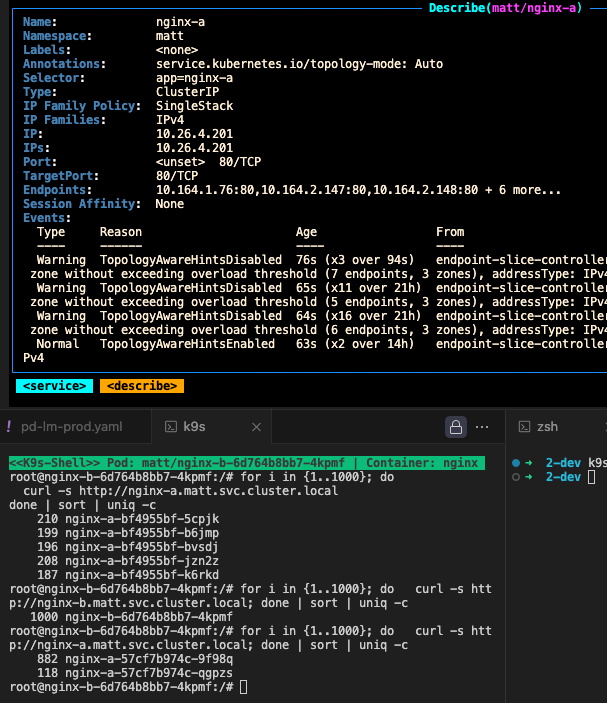
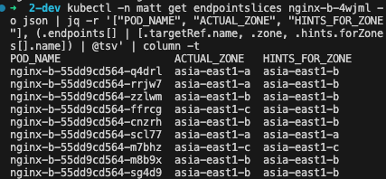
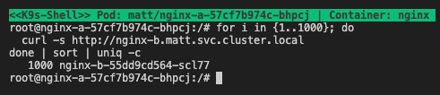
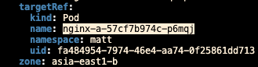
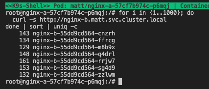

## TL;DR
Topology Aware Routing(TAR)的設置
與流量分配機制

## 背景
公司最近服務開始要從單 zone 上到 multi-zone
起初因為，上到 multi-zone 之後，跨 zone 的傳輸費用暴增
故想透過設置 `TAR` 除了支援 mult-zone 以外一定程度減少跨 zone 的網路傳輸費用

### 設置 TAR
設置方式其實很簡單，只需要在服務的 `svc` 加上 
```yaml
annotations:
    service.kubernetes.io/topology-mode: "Auto"
```

### 這時候我們可以做幾個測試
測試 config 參考
```yaml
apiVersion: apps/v1
kind: Deployment
metadata:
  name: nginx-a
  namespace: matt
spec:
  replicas: 3
  selector:
    matchLabels:
      app: nginx-a
  template:
    metadata:
      labels:
        app: nginx-a
    spec:
      # 使用 topologySpreadConstraints 強制平均分佈
      topologySpreadConstraints:
        - maxSkew: 1  # 最多允許相差 1 個 Pod
          topologyKey: topology.kubernetes.io/zone
          whenUnsatisfiable: DoNotSchedule
          labelSelector:
            matchLabels:
              app: nginx-a
      # 移除原本的 podAntiAffinity，因為 topologySpreadConstraints 已經處理分佈
      containers:
        - name: nginx
          image: nginx:latest
          ports:
            - containerPort: 80
          volumeMounts:
            - name: nginx-conf
              mountPath: /etc/nginx/conf.d
          resources:
            requests:
              cpu: "100m"
              memory: "128Mi"
            limits:
              cpu: "200m"
              memory: "256Mi"
      volumes:
        - name: nginx-conf
          configMap:
            name: nginx-conf
---
apiVersion: v1
kind: Service
metadata:
  name: nginx-a
  namespace: matt
  annotations:
    service.kubernetes.io/topology-mode: "Auto"
spec:
  selector:
    app: nginx-a
  ports:
    - protocol: TCP
      port: 80
      targetPort: 80
---
apiVersion: v1
kind: ConfigMap
metadata:
  name: nginx-conf
  namespace: matt
data:
  default.conf: |
    server {
      listen 80;
      location / {
        return 200 "$hostname\n";
      }
    }
```

#### 然而在實際測試後發現幾個特別的點
行為測試時，同仁只部署 2 顆 nginx-pod，TAR 功能正常、可運作。
但當在公司測試環境進行測試，卻發現 TAR `Disabled` 且網路分配依然是使用 `round-robin`。待 Pod 數量夠才會正常啟用


### TAR 設置機制
1. 服務 SVC 掛上 annotation 之後，對應的 resource `endpointslice` 會有對應流量分配設置!

2. 流量分配規則
依照 `cluster`  內的資源，分配每個 zone 的服務負載
從下面的 node 可以看到 cpu 資源分佈如下
zone-a: 12
zone-b: 80
zone-c: 4
```javascript
const nodes = [
    // asia-east1-a
    { zone: 'asia-east1-a', name: 'gke-matt-test-3b627bce-daoo', cpu: 4 },
    { zone: 'asia-east1-a', name: 'gke-pool-A-548e8958-2nxn', cpu: 8 },
    
    // asia-east1-b (10個節點)
    { zone: 'asia-east1-b', name: 'gke-pool-A-7ae1a02a-1fv1', cpu: 8 },
    { zone: 'asia-east1-b', name: 'gke-pool-A-7ae1a02a-8bjj', cpu: 8 },
    { zone: 'asia-east1-b', name: 'gke-pool-A-7ae1a02a-crk9', cpu: 8 },
    { zone: 'asia-east1-b', name: 'gke-pool-A-7ae1a02a-ft1u', cpu: 8 },
    { zone: 'asia-east1-b', name: 'gke-pool-A-7ae1a02a-j7jg', cpu: 8 },
    { zone: 'asia-east1-b', name: 'gke-pool-A-7ae1a02a-lvc8', cpu: 8 },
    { zone: 'asia-east1-b', name: 'gke-pool-A-7ae1a02a-px2g', cpu: 8 },
    { zone: 'asia-east1-b', name: 'gke-pool-A-7ae1a02a-z5z4', cpu: 8 },
    { zone: 'asia-east1-b', name: 'gke-pool-B-bfdf247d-9f1e', cpu: 8 },
    { zone: 'asia-east1-b', name: 'gke-pool-B-bfdf247d-xg6b', cpu: 8 },
    
    // asia-east1-c
    { zone: 'asia-east1-c', name: 'gke-matt-test-e8520bea-zpl4', cpu: 4 }
  ];
```
因此在 endpointslice 的分配規劃會接近
```
asia-east1-a: 12 cores ÷ 96 total cores = 12.5%
asia-east1-b: 80 cores ÷ 96 total cores = 83.3% 
asia-east1-c: 4 cores ÷ 96 total cores = 4.2%
```
為確保每個 zone 至少有一個服務實例，實際分配為
| zone-a | zone-b | zone-c |
| ------ | ------ | ------ |
| 1      | 7      | 1      |

### 流量測試
當我們從 `zone-a` 由 nginx-a 發起 request
流量全數由同一個 nginx-b 所承載



這次換從 `zone-b` 由 nginx-a 發起 request


回頭查看 `endpointslice` 的分配，換成會對負責 7 個 `zone-b` 的 `nginx-b` 做 `round-robin` 的輪詢

### 結論
跨 zone 的費用，沒少到
這個分配機制也蠻神奇的


