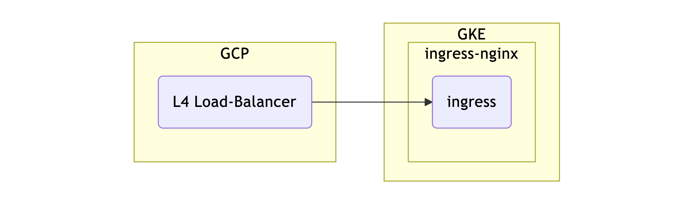
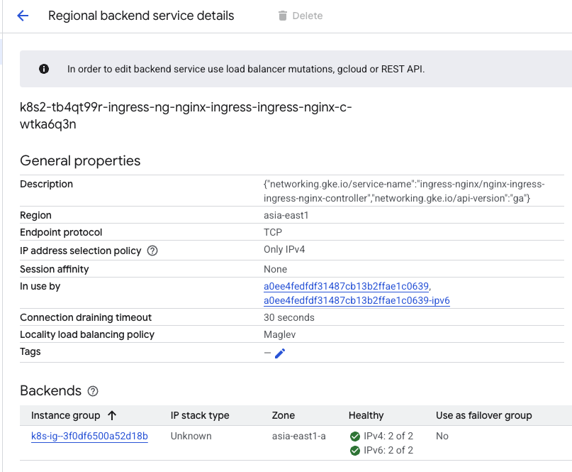
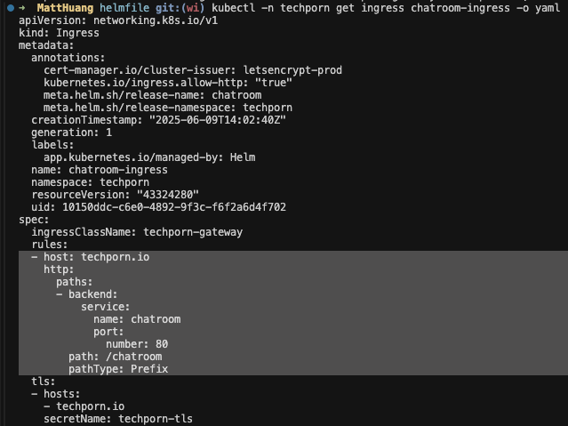
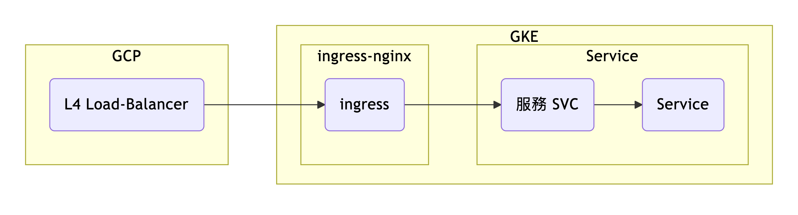
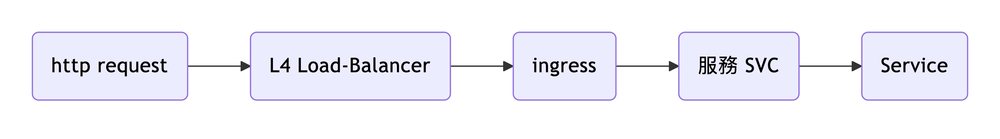

## TL;DR
Techporn 平台對於網路流量管理

### 背景
我們選擇用 `GKE` 作為服務部署的平台
流量則透過 `ingress-nginx` 來做控制

### 核心：`Ingress-Nginx`
透過 `Helm` 部署的 ingress-nginx 會建立一個 ingress-nginx-controller 來管理相關的 ingress
同時，會在 GCP 建立 L4 的 Load-Balancer 來承接流量
此時的架構圖如下

該 `LB` 也會有相關 `config`

接續，我們會對服務的 ingress 設置 `path` 以及對應的 `服務 SVC`
讓 ingress 知道要怎麼導流(如圖)

加上服務的架構圖

因此 request flow 會是

至於 DNS 的部分，是看有沒有掛 Domain，有 Domain 才需要解析
