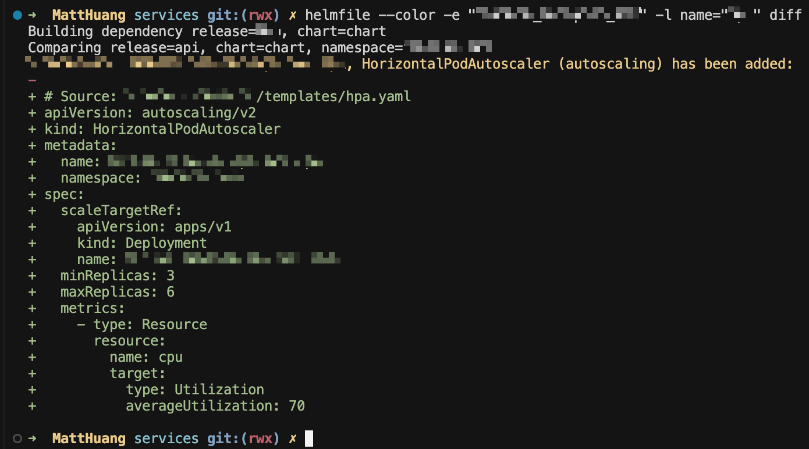

## TL;DR
當 Pod 需要同時掛載同一個 PVC，並且多個 replicas 都能同時讀寫資料時，就需要使用 ReadWriteMany (RWX) 的 PVC。本文將介紹三種常見方式：

1. 利用 GCP Filestore
2. 使用 外部 NFS Server
3. 透過 GCS CSI Driver

## 背景
在 Kubernetes 中，如果一個服務使用 PVC 儲存資料，並且需要高可用性 (HA)，那麼多個 replicas 的 Pod 就必須同時掛載並存取相同的資料。這時候就需要 RWX 型別的 PVC。

---

### 方法一：利用 GCP Filestore 建立 RWX PVC
啟用 Filestore CSI Driver
在 GKE 叢集設定中，開啟 `gcp_filestore_csi_driver_config`:
```
~ addons_config {
    ~ gcp_filestore_csi_driver_config {
        ~ enabled = false -> true
    }
}
```
建立 StorageClass
建立一個使用 Filestore 的 StorageClass:
```
apiVersion: storage.k8s.io/v1
kind: StorageClass
metadata:
  name: {{ .Values.storageClassName }}
provisioner: filestore.csi.storage.gke.io
parameters:
  tier: BASIC_HDD                          # 可選 BASIC_HDD 或 BASIC_SSD
  network: {{ .Values.your_pvc_network }}
reclaimPolicy: Delete
allowVolumeExpansion: true
volumeBindingMode: WaitForFirstConsumer    # 也可設為 Immediate

```
可以透過指令 `kubectl get sc` 檢查：

成功後，建立 PVC 並掛載到 Pod，即會自動建立對應的 Filestore instance


並支援多個 Pod 同時掛載 RWX PVC。



> ⚠️ 注意：必須使用 GKE 1.33 以上版本，才能讓 Filestore 的最小容量從 1TB 降到 100GiB。
> 👉 [官方文件參考](https://cloud.google.com/kubernetes-engine/docs/how-to/persistent-volumes/filestore-csi-driver?hl=zh-tw)


### 方法二：透過外部 NFS Server

另一個常見方式是使用 NFS Server，搭配 CSI Driver 來建立 PVC。
運作流程如下圖：


👉 詳細步驟可參考 [小信豬的原始部落](https://godleon.github.io/blog/Kubernetes/k8s-Config-StorageClass-with-NFS/)

### 方法三：使用 GCS CSI Driver 掛載 GCS

除了 Filestore 與 NFS，也可以使用 Google Cloud Storage (GCS) 搭配 CSI Driver 提供 RWX PVC。

步驟：

1. 安裝 gcs-csi-driver
2. 建立 PV & PVC，掛載至 GCS
3. 透過 Workload Identity (WI) 授權 GCS 權限

範例：建立 PV & PVC
```
---
apiVersion: v1
kind: PersistentVolume
metadata:
  name: gcs-fuse-csi-pv
spec:
  accessModes:
  - ReadWriteMany
  capacity:
    storage: 1Gi
  storageClassName: example-storage-class  
  mountOptions:
    - implicit-dirs
  csi:
    driver: gcsfuse.csi.storage.gke.io
    volumeHandle: {{ .Values.bucketname }}
  claimRef:
    name: gcs-fuse-csi-static-pvc
    namespace: {{ .Release.Namespace }}
---

apiVersion: v1
kind: PersistentVolumeClaim
metadata:
  name: gcs-fuse-csi-static-pvc
  namespace: {{ .Release.Namespace }}
spec:
  accessModes:
  - ReadWriteMany
  resources:
    requests:
      storage: 1Gi
  storageClassName: example-storage-class
```

建立 ServiceAccount 並綁定 Workload Identity
```
# serviceAccount.yaml
apiVersion: v1
kind: ServiceAccount
metadata:
  annotations:
    iam.gke.io/gcp-service-account: {{ .Values.WI_GOOGLE_SERVICE_ACCOUNT }}
  name: gcs-fuse
  namespace: {{ .Release.Namespace }}

```

建立 Deployment 並掛載 PVC
```
# Deployment.yaml
apiVersion: apps/v1
kind: Deployment
metadata:
  name: gcs-fuse-csi-example
  namespace: {{ .Release.Namespace }}
spec:
  replicas: 2
  selector:
    matchLabels:
      app: gcs-fuse-csi-example
  template:
    metadata:
      labels:
        app: gcs-fuse-csi-example
      annotations:
        gke-gcsfuse/volumes: "true"                 # 透過 gcs-fuse sidecar 互動
        gke-gcsfuse/cpu-request: "20m"              # 調整 sidecar 資源
        gke-gcsfuse/memory-request: 128Mi           # 調整 sidecar 資源
        gke-gcsfuse/ephemeral-storage-limit: 1Gi    # 調整 sidecar 資源
    spec:
      containers:
      - image: busybox
        name: busybox
        command: ["sleep"]
        args: ["infinity"]
        volumeMounts:
        - name: gcs-fuse-csi-static
          mountPath: /data
      serviceAccountName: gcs-fuse
      volumes:
      - name: gcs-fuse-csi-static
        persistentVolumeClaim:
          claimName: gcs-fuse-csi-static-pvc

```
完成後，即可讓多個 Pod 同時掛載 GCS PV，並以 RWX 模式存取資料。
reference:
- [為 GKE 設定 Cloud Storage FUSE CSI 驅動程式 Sidecar 容器](https://cloud.google.com/kubernetes-engine/docs/how-to/cloud-storage-fuse-csi-driver-sidecar?hl=zh-tw)
